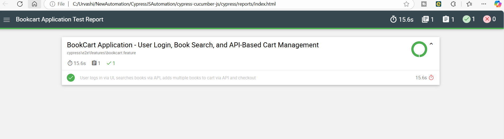

# Cypress Cucumber Test Automation Framework

### Introduction
This project is an automated test framework built using Cypress with Cucumber BDD, designed for testing the BookCart application. It supports UI and API testing, integrates reporting, and ensures smooth end-to-end testing.

### Features
🔹 Cypress + Cucumber Integration (BDD-based test automation)
🔹 UI & API Testing (Validating UI & API response for test scenario)
🔹 Data-Driven Testing (Using Cucumber Data Tables)
🔹 Page Object Model (POM) (Separation of concerns for maintainability)
🔹 Mochawesome Reports (Rich HTML test execution reports)

### Installation

Prerequisites:
🔹 Install Node.js (v18+ recommended)
🔹 Install Cypress and dependencies:npm install

### Running Tests
To run test in integrated terminal- npm run cypress-run-book-cart 

### Generating Reports
To generate report in html format - npm cy:run will give below report

To view report open index.html using browser (from reports directory) 

### Test Execution Flow
1️⃣ User logs in via UI
2️⃣ Book search via API (Cypress intercept API validation)
3️⃣ Add multiple books to cart via API
4️⃣ Verify cart updates in UI
5️⃣ Checkout process through UI
6️⃣ Order verification via API

### User story and Testcases 
🔹 Refer to excel file shared via email

### Enhancements
🔹 More scenarios can be added including negative scenario

